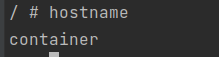

# iu-virtualization-lab-4

This is a linux container written in C language.

After running, it provides an interactive shell to communicate with it.

## Key features

### Separate PID namespace

As you see from the screenshot below, `./container` process has PID 1.


### Separate UTS namespace(for networking)

As you see from the screenshot below, container has its own hostname.



### Separate network namespace

As you see from the screenshot below, container has 2 its network interfaces. 
For example, we may ping the parent.


### Separate mount namespace(also, isolated file system)

For example, I created the file `I_AM_FILE` in the container(and it is visible).
However, this file is not visible in the host OS.


### Isolated file systems supports all binaries from Alpine Linux 3.7.0

You may run any binary available in linux alpine. For example, I run `echo` command.


### Container filesystem in a file by using loop

I created virtual storage device using file as image that contains file system info and rootfs.

### Controlling resources using cgroups

I limited the resource MAX_PIDS using cgroups.

For example, I set `MAX_PIDS=5`. In this case, max number of running processes is 5.


## How to run?
Pre-requirements: gcc compiler.

1. Prepare the rootfs from linux alpine image:
```shell
mkdir root && cd root
curl -Ol http://nl.alpinelinux.org/alpine/v3.7/releases/x86_64/alpine-minirootfs-3.7.0-x86_64.tar.gz
tar -xvf alpine-minirootfs-3.7.0_rc1-x86_64.tar.gz
```
2. Compile and run the container as a root:
```shell
gcc ./container.c -o container && sudo ./container
```